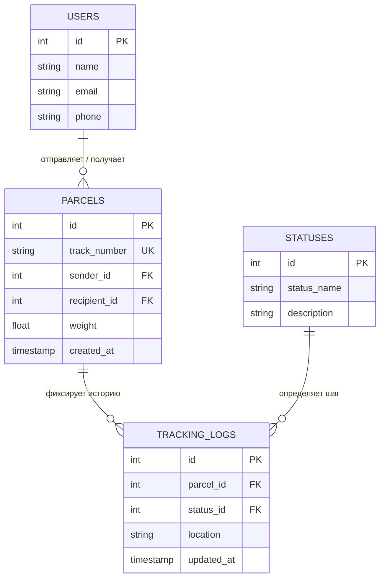

# Parcel Tracking Service — Система отслеживания почтовых отправлений

Система предназначена для автоматизации учета, логистики и сквозного мониторинга статусов почтовых отправлений. Проект сфокусирован на правильном проектировании реляционной модели данных, обеспечении высокой скорости поиска по трек-номерам и построении операционной аналитики для бизнеса.

---

## 1. Бизнес-анализ и требования

### Бизнес-цель
Оптимизировать логистические процессы компании за счет предоставления клиентам точной информации о местонахождении посылок в реальном времени, а менеджменту — прозрачной отчетности по KPI доставки.

### Пользовательские сценарии (Use Cases)
* **UC-1: Регистрация отправления (Оператор).** Оператор принимает посылку, фиксирует габариты, отправителя/получателя. Система генерирует уникальный трек-номер и создает запись.
* **UC-2: Обновление статуса (Сортировочный центр / Курьер).** Прибытие посылки в промежуточный пункт меняет её статус (например, "В пути", "Прибыло в сортировочный центр") с фиксацией времени и геолокации.
* **UC-3: Проверка статуса по трек-номеру (Клиент).** Клиент вводит трек-номер и видит текущий статус и всю историю перемещений посылки.
* **UC-4: Формирование аналитики (Менеджер/Аналитик).** Система выгружает отчеты по средней скорости доставки и задержкам на маршрутах.

---

## 2. Информационное моделирование и структура БД

База данных спроектирована по правилам **третьей нормальной формы (3NF)** для 6 основных сущностей. Это гарантирует отсутствие избыточности данных и защищает от аномалий при удалении или обновлении записей.

### ER-диаграмма данных (Entity-Relationship)
*Диаграмма визуализирует логическую структуру базы данных и связи между таблицами (One-to-Many):*



---

## 3. Бизнес-аналитика и SQL-запросы

Для выгрузки операционных метрик и мониторинга эффективности логистики (KPI) был разработан аналитический SQL-запрос. 

**Бизнес-задача:** Вывести список всех недоставленных посылок, которые находятся в пути более 5 дней, с указанием имени клиента и текущего местоположения, для выявления задержек.

```sql
WITH last_logs AS (
    SELECT 
        tl.parcel_id,
        tl.status_id,
        tl.location,
        tl.updated_at,
        ROW_NUMBER() OVER (PARTITION BY tl.parcel_id ORDER BY tl.updated_at DESC) AS rn
    FROM TRACKING_LOGS tl
)
SELECT 
    p.track_number AS "Трек-номер",
    u.name AS "Получатель",
    s.status_name AS "Текущий статус",
    ll.location AS "Последняя точка",
    ll.updated_at AS "Дата изменения",
    (CURRENT_DATE - p.created_at::date) AS "Дней в пути"
FROM PARCELS p
JOIN USERS u ON p.recipient_id = u.id
JOIN last_logs ll ON ll.parcel_id = p.id AND ll.rn = 1
JOIN STATUSES s ON ll.status_id = s.id
WHERE s.status_name NOT IN ('Доставлено', 'Возвращено')
  AND p.created_at < CURRENT_TIMESTAMP - INTERVAL '5 days'
ORDER BY "Дней в пути" DESC;
```
* **Польза для бизнеса:** Этот запрос позволяет логистам мгновенно реагировать на проблемные отправления, предотвращая жалобы клиентов и штрафные санкции.

---

## 4. Спецификация API (Пример контракта интеграции)

Для предоставления информации внешним виджетам отслеживания спроектирован REST-метод.

### Получение истории перемещений посылки
* **URL:** `/api/v1/shipments/track`
* **Метод:** `GET`
* **Query параметры:** `track_number=RU123456789BY`
* **Успешный ответ (Response 200 OK):**
```json
{
  "track_number": "RU123456789BY",
  "sender": "Иван Иванов",
  "recipient": "Виктория Минаева",
  "current_status": "В пути",
  "history": [
    {
      "status": "Принято в отделении связи",
      "location": "Минск ПО-1",
      "timestamp": "2026-10-01T10:00:00Z"
    },
    {
      "status": "В пути",
      "location": "Сортировочный центр Минск",
      "timestamp": "2026-10-02T14:30:00Z"
    }
  ]
}
```
* **Ошибка (Response 404 Not Found):**
```json
{
  "error": "Not Found",
  "message": "Посылка с трек-номером RU123456789BY не найдена в системе"
}
```

---

## Технологический стек и обоснование решений (Tech Stack)

При проектировании системной архитектуры и информационных моделей я опираюсь на оптимальный стек технологий, обеспечивающий высокую производительность, масштабируемость и безопасность ИТ-ландшафта.

| Направление | Используемые технологии | Обоснование аналитика |
| :--- | :--- | :--- |
| **Системный и бизнес-анализ** | BRD, FR, NFR, REST API, SOAP, OpenAPI/Swagger | Проектирование жестких интеграционных контрактов для устранения неопределенности между командами frontend и backend разработки. Разделение функциональных требований и архитектурных ограничений системы (NFR). |
| **Моделирование и схемы** | BPMN 2.0, UML (Sequence, Use Case, Class), C4 Model, PlantUML, Mermaid | Визуализация сквозных бизнес-процессов (As-Is / To-Be), межсистемных потоков данных и компонентной архитектуры приложений до этапа написания кода для снижения стоимости доработок. |
| **Работа с данными и СУБД** | PostgreSQL, MySQL, Advanced SQL, Redis, MongoDB | Проектирование реляционных баз данных с нормализацией до третьей нормальной формы (3NF) для обеспечения 100% целостности данных. Оптимизация производительности запросов с использованием оконных функций (`ROW_NUMBER`) и CTE. |
| **Форматы данных и валидация**| JSON, YAML, XML, XSD | Создание схем для строгой валидации входящих структур (payload) на внешнем контуре системы для защиты от runtime-ошибок и мусорных запросов. |
| **Языки программирования** | Go (Golang), Python (Basic) | **Go** — чтение кода, проектирование роутинга, хендлеров и логики микросервисов под требования высокой интенсивности чтения/записи. **Python** — базовая предобработка данных. |
| **Инфраструктура и инструменты**| Jira, Confluence, Git (GitFlow), Docker, Docker Compose, Linux/Bash, Postman | Ведение базы знаний компании (Single Source of Truth), оркестрация и контейнеризация локального окружения систем, тестирование и симуляция контрактов API. |
| **Методологии управления** | Agile (Scrum, Kanban), Waterfall | Понимание жизненного цикла разработки ПО (SDLC) и гибкое управление рамками проекта (Scope Management) в зависимости от бизнес-целей. |
